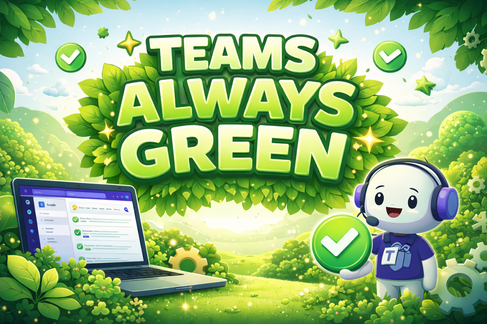

<p align="center">
  
</p>

#  Teams Always Green

[](https://github.com/alexphillips-dev/Teams-Always-Green/releases/latest)
[](LICENSE)
[](README.md#requirements)
[](README.md#requirements)

Keep your Microsoft Teams status active without babysitting your keyboard. Teams Always Green is a lightweight Windows tray app that gently toggles Scroll Lock on a schedule you control -- so your status stays green while you focus on real work.

**Why you'll like it**
- **Set-and-forget:** Runs quietly in the tray.
- **Smart scheduling:** Work hours, pauses, and quick overrides.
- **Profiles:** Switch configurations in seconds.
- **Helpful logging:** Debug detail when you need it.
- **Language support:** English, Spanish, French, German (auto-detect + manual).

## Why This Project Exists

I built this project after seeing how easily Teams presence can switch to **Away** during normal work, and how that status can become a proxy for performance. I was frustrated by being monitored mostly through Teams presence instead of the quality and outcomes of the work itself. I wanted a simple, reliable tray app that runs quietly in the background and removes that noise while I focus on my job.

This was not created to avoid work or to encourage misuse. It was created to reduce false signals and make day-to-day work more predictable. It is also useful in legitimate scenarios like keeping a PC awake during long meetings, presentations, or other hands-off workflows where lock/sleep interruptions are disruptive.

---

## Quick Setup (Recommended)

**One-line install (PowerShell):**

```powershell
irm "https://raw.githubusercontent.com/alexphillips-dev/Teams-Always-Green/main/Script/QuickSetup/QuickSetup.ps1?ts=$([guid]::NewGuid())" | iex
```

1) Download `Script/QuickSetup/QuickSetup.cmd` from the repo (it always pulls the latest installer).  
2) Double-click it.  
3) Choose your install folder (default: `Documents\Teams Always Green`).

The installer downloads the app scripts/modules, requires and validates `QuickSetup.manifest.json`,
verifies every downloaded file hash, and blocks untrusted source URLs.
It creates required folders and can set up shortcuts. A setup summary appears at the end.
Optional: choose **portable mode** to skip shortcuts. Setup logs are saved to `%TEMP%\TeamsAlwaysGreen-QuickSetup.log`.

---

## Quick Start (3 steps)

1) **Install** with Quick Setup.  
2) **Start** from the tray icon.  
3) **Customize** in Settings (schedule, profiles, hotkeys, logging).

---

## Requirements

- Windows 10/11
- PowerShell 5.1 or 7.x

---

## Common Setups

- **Work hours only:** Enable Schedule and set Start/End time.
- **No distractions:** Disable balloon tips + use Quiet Mode.
- **Multiple profiles:** Create "Office" and "Off-hours" profiles and switch from tray.
- **Hands-free:** Use hotkeys to Start/Stop or Pause without opening Settings.

---

## Manual Install

1) Create a folder (example: `Documents\Teams Always Green`).  
2) Copy the entire `Script\` folder from the repo into it.  
3) Copy `Meta\Icons\` and `VERSION` from the repo into the install folder.  
4) Run:

```powershell
powershell.exe -NoProfile -ExecutionPolicy Bypass -File "Script\Teams Always Green.ps1"
```

---

## Usage

- Right-click the tray icon for Start/Stop, Settings, History, Restart, and more.
- Use **Settings** for profiles, scheduling, hotkeys, appearance, and logging.

---

## Architecture

- See `docs/architecture.md` for startup flow, module boundaries, and data-path model.

---

## Folder Layout

```
Teams Always Green\
  .editorconfig
  docs\
    architecture.md
  Script\
    Teams Always Green.ps1
    Core\
    Features\
      Hotkeys.ps1
      Profiles.ps1
      Scheduling.ps1
      UpdateEngine.ps1
    I18n\
    Tray\
    UI\
  Script\Uninstall\
    Uninstall-Teams-Always-Green.ps1
    Uninstall-Teams-Always-Green.vbs
  Script\QuickSetup\
    QuickSetup.ps1
    QuickSetup.cmd
    QuickSetup.manifest.json
  Teams Always Green.VBS
  CHANGELOG.md
  Debug\
  Meta\
    Icons\
    Readme\
      Banner.png
      AI_Assisted_Banner.png
```

Runtime data (standard install):
- Logs: `%LOCALAPPDATA%\TeamsAlwaysGreen\Logs\Teams-Always-Green.log`
- Bootstrap: `%LOCALAPPDATA%\TeamsAlwaysGreen\Logs\Teams-Always-Green.bootstrap.log`
- Settings: `%LOCALAPPDATA%\TeamsAlwaysGreen\Settings\Teams-Always-Green.settings.json`
- State: `%LOCALAPPDATA%\TeamsAlwaysGreen\Settings\Teams-Always-Green.state.json`

Portable mode stores runtime data in the install folder (`Logs\`, `Settings\`, `Meta\`).

---

## Troubleshooting

- **App won't appear:** Check `Debug\*.vbs.log` and `%LOCALAPPDATA%\TeamsAlwaysGreen\Logs\*.log`.  
- **Settings not saving:** Ensure `%LOCALAPPDATA%\TeamsAlwaysGreen\Settings` is writable.  
- **Weird behavior after updates:** Use **Restart** from the tray.
- **Quick Setup stops at Step 2:** Check `%TEMP%\TeamsAlwaysGreen-QuickSetup.log` for trusted URL or integrity validation failures.

---

## Security & Privacy

- **Local-only behavior:** No data collection.
- **Network access:** Used only for update checks (if enabled).
- **Files created:** Logs/settings/state are stored in your user profile (`%LOCALAPPDATA%\TeamsAlwaysGreen`) for standard installs, or in the install folder for portable mode.
- **Profile integrity:** Exported profile files include a SHA-256 signature; imports validate signatures and can block unsigned/invalid profiles in strict mode.

### Security Hardening

- **Security Mode bundle:** A single toggle in **Settings -> Advanced** to enforce strict import/update policy, update hash/signature requirements, permission hardening, and safer path behavior.
- **Strict imports:** `StrictSettingsImport` and `StrictProfileImport` can block unknown or malformed keys during imports.
- **QuickSetup supply-chain checks:** QuickSetup only accepts trusted raw GitHub URLs for this repo and requires a valid manifest + per-file hash verification.
- **Trusted update source:** Updates are validated against configured `UpdateOwner`/`UpdateRepo` and trusted GitHub URLs.
- **Update integrity gates:** `UpdateRequireHash` and `UpdateRequireSignature` can require SHA-256 and detached signature validation before applying updates.
- **Safer update relaunch:** After update apply, restart uses an explicit system PowerShell path (`%WINDIR%\System32\WindowsPowerShell\v1.0\powershell.exe`).
- **Script signature policy:** `RequireScriptSignature` with optional `TrustedSignerThumbprints` enforces Authenticode trust at startup.
- **Path protections:** External path usage can be disabled; unsafe link-style reparse paths are blocked for sensitive loads.
- **Rate limiting:** Update checks and import actions are throttled to reduce abuse loops.
- **Audit chain:** Security/audit log entries include a hash chain to help detect tampering.

---

<p align="center">
  
</p>

## Development Transparency

This project is AI-assisted.

AI tooling is used to accelerate drafting, refactoring, testing, and documentation. Final decisions, acceptance criteria, and release direction remain human-led.

To keep quality and trust high:
- Every meaningful change is reviewed before merge.
- Automated quality gates run before release (`parse` checks, analyzer, privacy scan, Pester tests, and QuickSetup manifest freshness).
- Security-sensitive paths (installer/update integrity and trust checks) are validated in code and covered by tests.
- If a change does not pass checks, it does not ship.

The goal is simple: use AI for speed, without lowering the bar on reliability, safety, or maintainability.

---

## Developer Quality & Release

Versioning discipline:
- `VERSION` must be `major.minor.patch` (SemVer).
- `CHANGELOG.md` must include both `## [Unreleased]` and a section for the current `VERSION`.

1. Run local quality checks: `powershell -NoProfile -ExecutionPolicy Bypass -File .\Tools\Invoke-QualityChecks.ps1`
2. Enable local pre-commit guardrails once per clone: `powershell -NoProfile -ExecutionPolicy Bypass -File .\Tools\Enable-GitHooks.ps1`
3. Refresh installer manifest: `powershell -NoProfile -ExecutionPolicy Bypass -File .\Tools\Generate-QuickSetupManifest.ps1`
4. Sign release scripts (certificate in cert store required): `powershell -NoProfile -ExecutionPolicy Bypass -File .\Tools\Sign-Release.ps1 -CertificateThumbprint <THUMBPRINT>`
5. `.github/workflows/quality.yml` runs privacy/security scanning + analyzer + Pester + manifest freshness checks.
6. `.github/workflows/release-prep.yml` regenerates and commits `Script/QuickSetup/QuickSetup.manifest.json` on demand before release.

---

## Uninstall

**Standard install (recommended):** Use the Start Menu shortcut  
`Teams Always Green` -> **Uninstall Teams Always Green**

**Manual/portable uninstall:**
1) Exit the app from the tray.  
2) Remove shortcuts (if any):
   - Startup: `%APPDATA%\Microsoft\Windows\Start Menu\Programs\Startup\Teams Always Green.lnk`
   - Start Menu: `%APPDATA%\Microsoft\Windows\Start Menu\Programs\Teams Always Green\Teams Always Green.lnk`
3) Delete the install folder.

---

## License

MIT License. See `LICENSE`.
